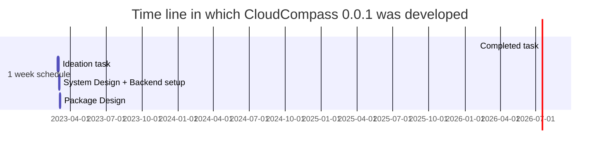

<h1> Team - Deep In AI </h1>
<h3> By. Zoya Jamadar </h3>

*Project  designed for Veritas U-Connect 2023

<h2> Description : </h2>

Small startups are increasingly migrating to the cloud, but the process of selecting the right cloud service provider can be challenging. Cloud Compass simplifies this process by providing a centralized platform that offers customized recommendations for cloud service providers based on your business needs.   
This platform also offers insights on how to **optimize your cloud usage and cost**. With Cloud Compass, small startups can **streamline the cloud migration process** and **find the right solutions that meet their specific requirements**, without having to navigate the complexities of cloud migration on their own.

<h2> Benefits of using cloud compass: </h2> 

* Cloud Compass provides up-to-date pricing information on the leading cloud service providers, including Amazon Web Services (AWS), Microsoft Azure, Google Cloud Platform, and more.

* With our cost calculators, detailed pricing breakdowns, and performance comparisons, you can easily compare the prices and features of different cloud services to **find the best option for your budget and requirements**.

* The recommendation system provides which **VERITAS service** can be a better suite for their application's data management needs (*This can be improved with more data for the model)

* Provides the perfect cloud service comparative information provider

<h2> Unique Selling Points: </h2>

🥰 **Zero code Dependency** - The system is designed in such a way that there is Zero Code Dependency for the frontend developers. Cloud compass is a python pip based package that get's easily embedded into applications without any programming hassels.

😍 **Reduced latency** - This also increases the processing time by reducing the load in the web application reducing the latency in website rendering.

<h2>Standing on the Evaluation parameters </h2>

✅ **Business Value** - When users have a clear view of the most optimal choice of cloud service provider, it enhances customer satisfaction and builds trust and reliability in the company. This, in turn, becomes an asset to the company.

✅ **Time to Market** - Using installable packages for software development can save time and speed up time-to-market compared to traditional methods. With each new release, upgrading the package version can help an organization stay ahead of the competition. 

✅ **Innovative and Efficient** - "AI-powered, personalized recommendations and user-friendly interface simplifies cloud migration with Cloud Compass." 

✅ **Users Experience** - (Din't get what's required to be mentioned here)

✅ **X-Factor** - Data is the most critical factor in a business, keeping this aspect as priority the algorithm is designed wrapping the critical information using the RSA algorithm.

<h2> What's the future enhancements & improvements to look at ? </h2>
Not everything is perfect ! So is our application and here are some potential fixes required for the future 

⚠️ Ideate over points of comparisions for inter and intra cloud services  
⚠️ Fix the api issue for AWS endpoints  
⚠️ Scale the application for realtime use-case  

Demo :

https://user-images.githubusercontent.com/84071291/222979661-262a83a3-26b9-436c-a281-1d4e07ef30e0.mp4

Find the pakages hosted here   
https://pypi.org/project/cloudcompass/

<h3>Featured Here 🥳</h3>
<a href="https://vox.veritas.com/t5/Inside-Veritas/Veritas-India-invited-30-college-students-to-the-first-uConnect/ba-p/899494" alt="FEATURED">
 @Veritas_VOX
</a> 
<a href="https://www.linkedin.com/posts/shbhmkmr_lifeatveritas-teamveritas-illuminate2023-activity-7037711678825803776-ExND?utm_source=share&utm_medium=member_desktop" alt="FEATURED Linkedn">
 @Veritas_Linkedin
</a>

